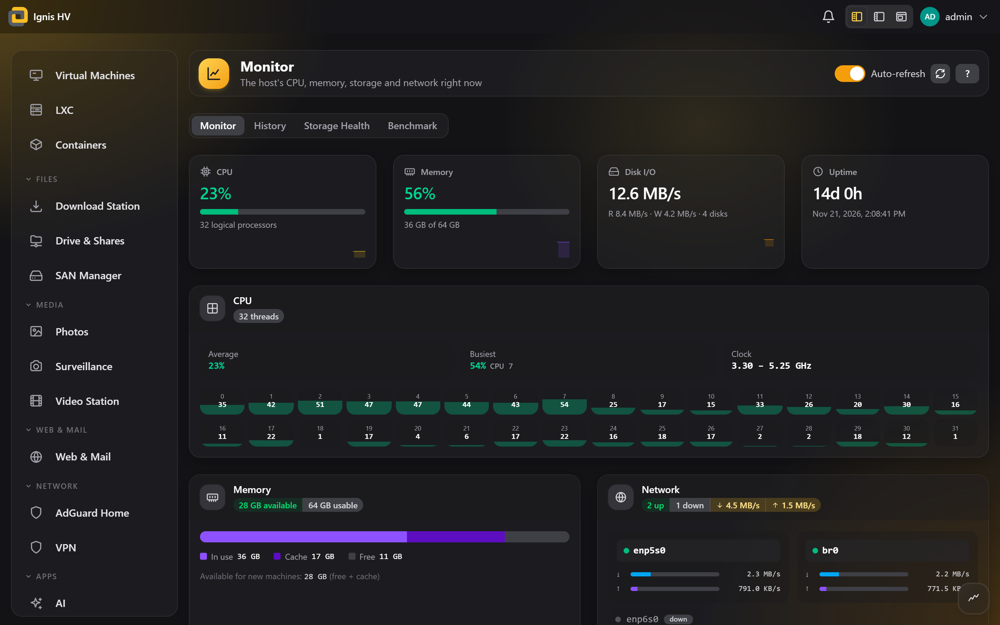
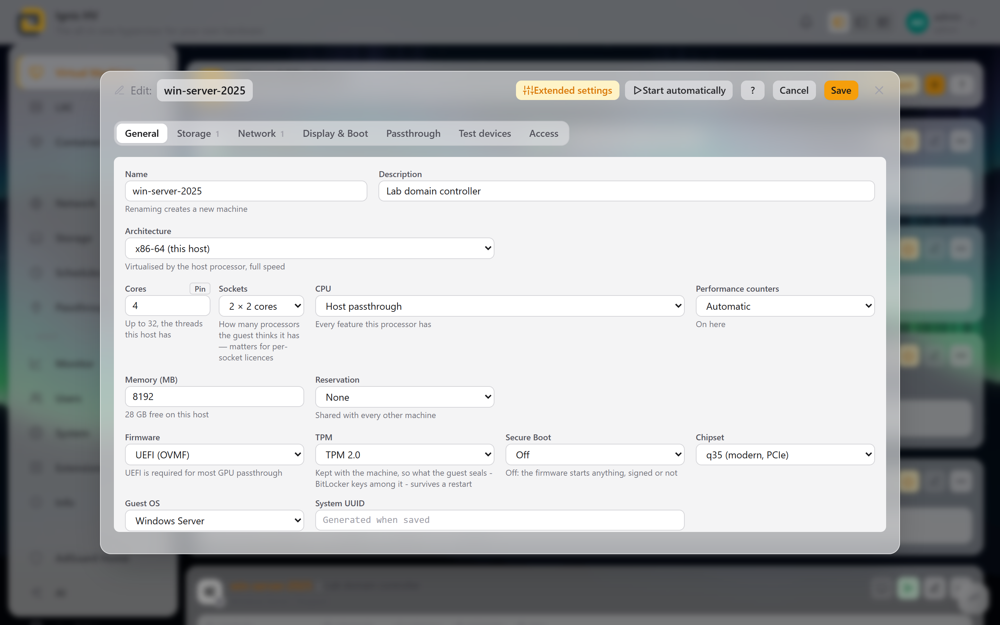
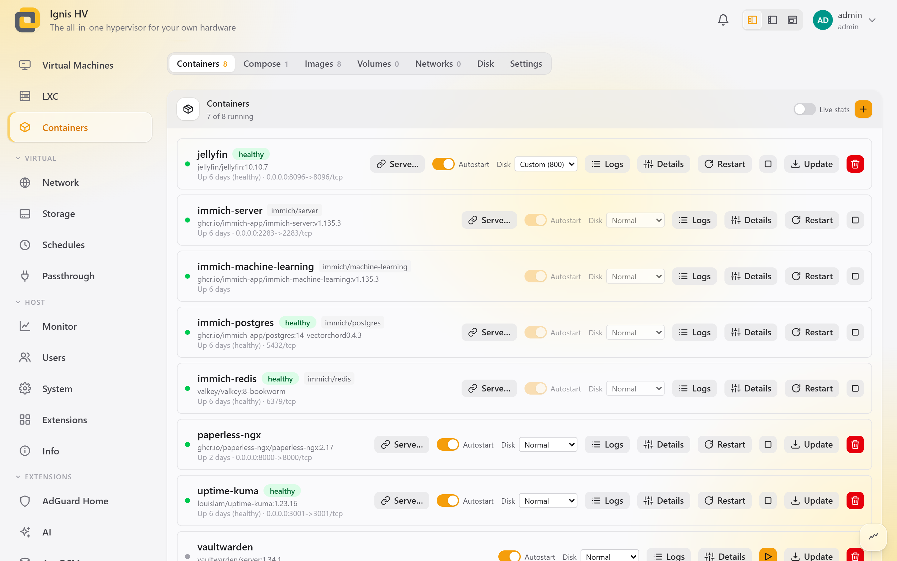
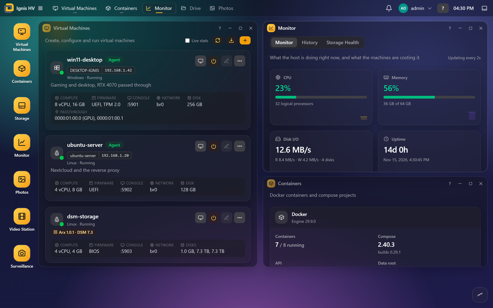
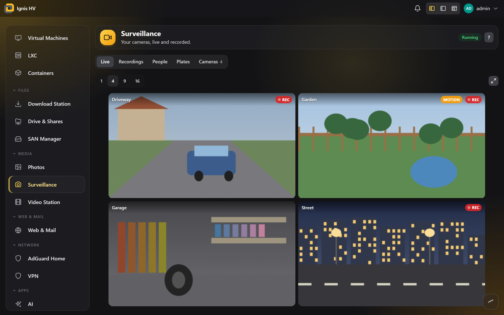
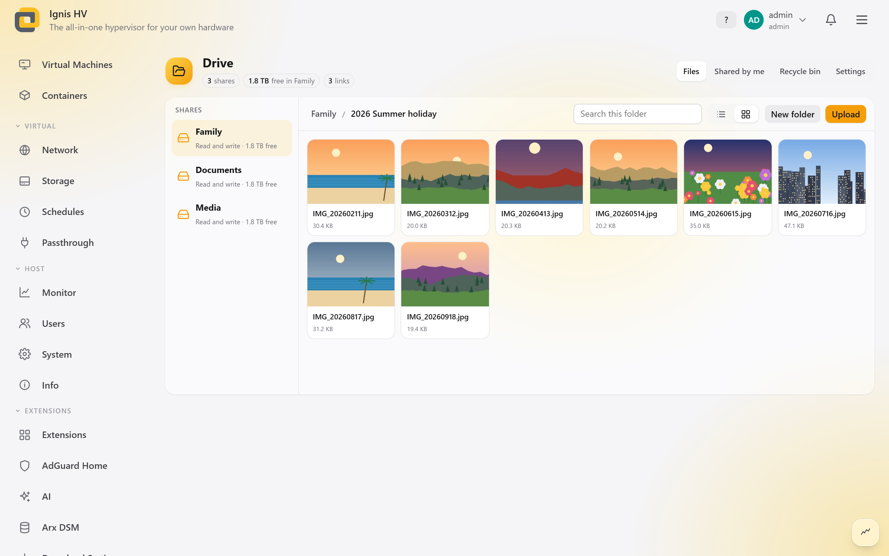

<div align="center">


### Ignis — The all-in-one hypervisor for your own hardware

Run virtual machines, containers and apps on your own x86-64 PC or server.<br>
Install it once, then manage everything from your browser.

<a href="https://github.com/AuxXxilium/ignis-hv/releases/latest"></a>
<a href="https://discord.auxxxilium.tech"></a>

<br><br>


</div>

---

> [!IMPORTANT]
> * Ignis is a **complete system** for the machine it runs on. It is installed to the machine's own disks and does not run alongside another operating system.
> * Ignis is free and will stay free forever.

> [!WARNING]
> Installing Ignis **erases every disk you select** for it. Back up anything on those disks first. The project is released for educational and learning purposes only, and I'm not liable for damage or loss of any kind.

---

## ✨ What Ignis does

Ignis turns a PC or server into a small, dedicated host for virtual machines, containers and apps. You install it from a USB stick, and from then on you do everything in your browser at `https://<your-ignis-address>`. You don't need a desktop or any other program.

### 🖥️ Virtual machines

* **Windows and Linux**: create, edit, clone and run Windows, Windows Server and Linux machines. Each machine can have its own TPM 2.0 and Secure Boot with Microsoft's keys, so Windows 11 installs without workarounds
* **Screen in the browser**: open a machine's display in a browser tab. You can change its CD/DVD, and shut it down, reset it or power it off from the same window
* **Snapshots and backups**: save a machine's state and go back to it. Back it up on a timetable, and old snapshots are cleaned up for you
* **Schedules for everything**: plan machine tasks, container updates and the tasks of your apps, such as nightly website and mail backups, in one place
* **Import and export**: bring in machines from ESXi, Hyper-V, VirtualBox or an `.ova` file, and export them as `.ova` for other systems
* **Your choice of CPU**: give a machine the host's own processor, or a fixed generation it keeps when you move it to other hardware
* **Passthrough**: give a machine a real graphics card, network card, disk controller, USB device or a whole disk
* **Start at boot**: choose which machines start with the host, and in what order

### 📦 Containers

* **Docker in the browser**: create and run containers and compose projects, see their logs and live usage, and manage their networks and volumes
* **Easy updates**: update by hand or on a timetable. If an update fails, the old version comes back

### 🗄️ Storage and the host

* **Disks your way**: the system on one disk or a mirror, your data on one disk or software RAID. Add more disks later as extra volumes
* **Storage Health**: see disk errors, run disk tests, check your data for hidden damage once a month, and let idle disks spin down
* **Monitor and History**: what the host and every machine are doing right now, and over the last hour, day, week or month
* **Several hosts as one**: link your Ignis hosts and run their machines from one interface. A machine can have a standby copy on a second host, ready if the first one fails
* **For your smart home**: a read-only interface for Home Assistant, Prometheus and similar apps

### 🌐 Network

* **Networks for your machines**: private networks, or bridges that put machines straight on your network. VLANs and bonded network cards are supported, also per machine
* **HTTPS**: with your own certificate or a free one from Let's Encrypt

### 🔐 Sign-in and security

* **Users and roles**: admin, operator and viewer accounts, each limited to the machines and pages you choose
* **Two-factor sign-in**: with an authenticator app, recovery codes for emergencies and codes by email. A browser you trust can skip the code for 30 days
* **Screen lock**: Ignis locks itself after the time you choose, and you unlock it with your password

### 🧩 Apps

Add apps from the **Extensions** tab. Install only the ones you need; each one is updated on its own, apart from Ignis. When an app needs another one, the tab tells you and installs it with a click, and apps you have switched on start by themselves when Ignis starts.

| App | What it does |
| :-- | :-- |
| **Docker** | Runs containers on the Containers page |
| **Network Shares** | Shares folders over SMB like a NAS, and over SFTP and FTPS if you want |
| **Drive** | Your shared folders in the browser: upload, preview, and share files with a link, also with people who have no account. Needs Network Shares |
| **Photos** | Your photos as a timeline and in albums, sorted by people, places and things. Edit and share them |
| **Video Station** | Your movies and TV shows with posters, played in the browser. Also plays on TVs, consoles and Kodi |
| **Surveillance** | Records your IP cameras, live view in a grid, motion events and playback. Can recognise people, vehicles, faces and number plates, and alert you |
| **Download Station** | Downloads links, torrents and magnet links into a folder you choose |
| **Web Station** | Hosts your own websites with PHP 8.3, 8.4 or 8.5 and databases, including WordPress in one click, each with its own certificate. Also a DNS server for your own domains that fills in its records by itself |
| **Mail Server** | Email for your own domain, with webmail, a spam filter and help with the DNS settings. Works best with Web Station |
| **VPN** | Reach your home network from anywhere with WireGuard, OpenVPN, IPsec or Tailscale, or send machines and containers through a VPN |
| **SAN Manager** | Offers storage to other computers over iSCSI |
| **Game Servers** | Runs servers for Minecraft, Valheim, Factorio and about 145 more games, with a console, backups and timetables. Needs Docker |
| **AI** | Runs language models on your own GPU, beside online services such as OpenAI, Anthropic and Gemini, all in one chat |
| **DSM machines** | Sets up Synology DSM machines with the Arx loader and keeps the loader up to date |
| **AdGuard Home** | Blocks ads and trackers for your whole network as its DNS server, on the network cards you choose |
| **DHCP Server** | Hands out addresses on the networks you choose |
| **Firewall** | Decides who can reach which service on Ignis, and can filter traffic between two network ports |
| **NVIDIA** | The NVIDIA driver, so containers can use the GPU |
| **Video Compute Runtime** | Video conversion on your GPU for the media apps, and 3D graphics for Linux machines without passing a card through |
| **Vision Runtime** | The image recognition that Photos and Surveillance use |

> [!NOTE]
> Some of these apps are brand new. If one is not on the Extensions tab yet, it comes with one of the next releases. **Web Station** needs ports 80 and 443 for your websites, so it moves the Ignis interface to ports 8080 and 8443. It asks you to confirm the move first. Web Station's DNS server and AdGuard Home can run side by side, each on its own network card: for example the DNS server on the card that faces the internet and AdGuard Home on your home network's.

You can also make an app of your own. See [extensions](extensions/README.md).

---

## 🧭 How it works

```
USB stick → Installer → choose disks → Ignis on the machine's own disks
                                          └─ web interface at https://<address>
                                               ├─ virtual machines
                                               ├─ containers
                                               ├─ apps
                                               └─ host: storage, network, users, updates
```

Ignis keeps two things apart: **the system**, which each update replaces as a whole, and **your data**: machines, disk images, containers, apps and settings. Your data lives on a volume of its own, so an update never touches it, and a failed update can be undone.

---

## 🖱️ The web interface

| Page | What you do there |
| :-- | :-- |
| **Virtual Machines** | Create, start, stop and edit machines, open their display, take snapshots, clone, import and export |
| **Containers** | Run containers and compose projects, see their logs and usage, update and clean up |
| **Network** | Networks for your machines, VLANs and bonds |
| **Storage** | Disk images, ISOs, uploads and extra volumes, shown like a file manager |
| **Schedules** | Timed start, shutdown, snapshot, backup, container and data check tasks, and the tasks your apps offer: website and mail backups, WordPress updates, downloads only at night, cameras on and off, and more |
| **Passthrough** | Graphics cards, PCI and USB devices your machines can use |
| **Monitor** | The host right now, its **History** over time, and **Storage Health** |
| **Users** | Accounts, roles, and who sees which machines and pages |
| **System** | The host's name, network, time, CPU and fans, linked hosts, the smart home interface, email, services, updates and a terminal |
| **Extensions** | Install, update, turn on, restart and remove apps, and see which apps need each other |
| **Info** | What this host supports, and a report to copy into a bug report |

Every page has a **?** button with help for that page.

Pick the look you like from the account menu: a light or dark mode, an accent colour, and either the classic layout with a sidebar or a **desktop** where every page opens in a window of its own, with a taskbar and wallpapers.

### 📸 A look inside

<table>
  <tr>
    <td width="50%"><br><sub><b>Monitor</b>: the host right now, down to every core</sub></td>
    <td width="50%"><br><sub><b>History</b>: the last hour, day, week or month</sub></td>
  </tr>
  <tr>
    <td width="50%"><br><sub><b>Machine editor</b>: CPU, memory, firmware and TPM on one tab</sub></td>
    <td width="50%"><br><sub><b>Containers</b>: containers with their logs, details and updates, beside the machines</sub></td>
  </tr>
  <tr>
    <td width="50%"><br><sub><b>Extensions</b>: install the apps you want, each updated on its own</sub></td>
    <td width="50%"><br><sub><b>Virtual Machines</b>: everything about a machine at a glance</sub></td>
  </tr>
  <tr>
    <td colspan="2"><br><sub><b>Desktop</b>: every page in a window of its own, with a taskbar and your wallpaper</sub></td>
  </tr>
</table>

### 🧩 Apps in action

<table>
  <tr>
    <td width="50%"><br><sub><b>Photos</b>: your pictures as a timeline, by people, places and things</sub></td>
    <td width="50%"><br><sub><b>Video Station</b>: your films and shows with posters, in the browser and on your TV</sub></td>
  </tr>
  <tr>
    <td width="50%"><br><sub><b>Surveillance</b>: live view, recordings and alerts for your IP cameras</sub></td>
    <td width="50%"><br><sub><b>Drive</b>: your shared folders in the browser, with share links</sub></td>
  </tr>
  <tr>
    <td width="50%"><br><sub><b>Web Station</b>: your websites with HTTPS, PHP 8.3 to 8.5 per site and WordPress in one click</sub></td>
    <td width="50%"><br><sub><b>Game Servers</b>: Minecraft, Valheim and about 150 more, with console and backups</sub></td>
  </tr>
  <tr>
    <td width="50%"><br><sub><b>Download Station</b>: links and torrents straight onto your storage</sub></td>
    <td width="50%"><br><sub><b>VPN</b>: WireGuard, OpenVPN, IPsec and Tailscale, with a QR code per device</sub></td>
  </tr>
  <tr>
    <td width="50%"><br><sub><b>Mail Server</b>: email for your own domain, with a DNS check</sub></td>
    <td width="50%"><br><sub><b>DNS server</b>: your domains' records, filled in by your websites and mail</sub></td>
  </tr>
</table>

<sub>Screenshots of the real interface with sample data.</sub>

---

## 📋 What you need

* An x86-64 PC or server, with virtualisation (Intel VT-x or AMD-V) turned on in the BIOS
* For passthrough: Intel VT-d or AMD-Vi, also turned on in the BIOS
* A USB stick for the installer
* At least one disk for Ignis. 64 GB or more is a good start, plus room for your machines
* Two or more disks if you want RAID
* A wired network

Once Ignis is running, the **Info** page shows what your host supports, and what is missing.

---

## 💿 Installing

1. Download the latest ISO from the [releases](https://github.com/AuxXxilium/ignis-hv/releases/latest) and write it to a USB stick
2. Start the machine from the stick and choose **Install**
3. Pick the disks to install to. **Everything on them is erased**
4. Choose where the system goes (one disk or a mirror) and how the disks for your data work together. Only the options your disks allow are offered
5. Set a root password
6. Remove the stick and restart. The screen shows the address to open in your browser. Sign in as `root`

With several disks, every disk can start Ignis, so the machine still boots if one of them fails.

---

## ⬆️ Updates

Ignis checks for new releases by itself and tells you through the bell at the top. You install them under **System → Update**: **Download and stage** fetches the new version and checks it, and your machines keep running meanwhile. **Apply** restarts into the new version.

Apps are updated on their own, on the **Extensions** tab.

Your settings, passwords and certificates are kept. Machines, disk images, containers, networks, users and app data are never touched by an update.

The previous version is kept. If something is wrong after an update, choose it from the boot menu to go back.

---

## 🔒 Security

* Every action checks who is signed in and what they may do
* Repeated wrong passwords at the login page or over SSH get the address blocked for a while
* Two-factor sign-in and the screen lock protect your account, even on a shared computer
* A machine's display can only be opened through the signed-in web interface
* Apps and containers have a lot of access to the host, so install only what you trust. Only admins can manage them

---

## 🧰 More from the Arc Project

| Project | Description |
| :-- | :-- |
| [Arc Loader](https://github.com/AuxXxilium/arc) | Redpill loader for DSM 7.x |
| [arx](https://github.com/AuxXxilium/arx) | The evolution of Arc: set up entirely from your browser |
| [Arc Control](https://github.com/AuxXxilium/arc-control) | DSM app for loader settings, monitoring and hardware tuning |
| [AuxXxilium](https://github.com/AuxXxilium) | Everything else from the Arc Project |

---

### Developer

- <a href="https://github.com/AuxXxilium">AuxXxilium</a>
- <a href="https://github.com/FulcrumCode">Fulcrum</a>

### License

GPL-3.0. The included third-party drivers keep their own licenses.

<div align="center">

[](https://github.com/AuxXxilium/ignis-hv)
[](https://discord.auxxxilium.tech)

</div>
